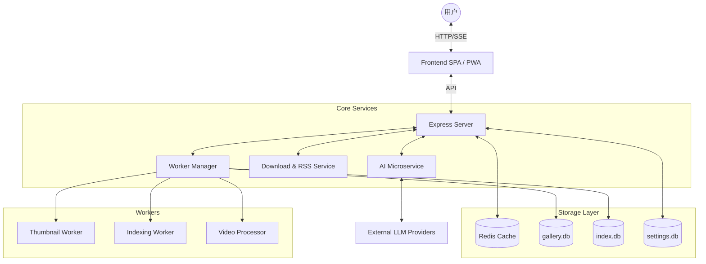

# Photonix | 光影画廊

[](https://nodejs.org/)
[](https://www.docker.com/)
[](LICENSE)
[](https://github.com/li88iioo/Photonix)
[](https://web.dev/progressive-web-apps/)

一个极简、AI 驱动的智能相册，专为现代 Web 设计。它集成了 PWA、流式加载、多数据库架构和高性能缓存，旨在提供极致的浏览体验和智能的交互方式。

---

## ✨ 核心亮点

### 🎭 AI 智能交互
- **AI 画中密语**：AI 扮演照片人物，通过第一人称视角提供沉浸式对话体验。
- **全模型支持**：兼容 OpenAI (GPT-4V)、Claude-3、Gemini 等主流视觉模型。
- **极致隐私**：对话历史仅存于浏览器 IndexedDB，支持导入导出，后端绝不触碰私密数据。
- **高性能架构**：内置 AI 微服务，采用内存队列与 Redis 持久化缓存，大幅降低 API 调用成本。

### 📥 资源订阅中心
- **多源订阅**：支持 RSS/Atom 协议，自动同步外部图库（如 Pinterest, Pixiv 等）的媒体流。
- **智能爬虫**：基于任务调度器 (TaskScheduler) 的并发控制，支持断点续传与重试机制。

### 🚀 极致性能
- **多库并发**：主库/设置库/索引库分离，彻底解决 SQLite 锁竞争，提升高并发下的响应速度。
- **流式加载**：自研图片流式渲染技术，海量照片也能瞬间秒开。
- **Worker 线程池**：缩略图生成、索引重建、视频 HLS 处理全部在独立线程运行，不阻塞主进程。

---

## 🏗️ 架构设计



---

## 🚀 快速开始

### 🐳 方式一：使用 Docker (推荐)

最快速的部署方式，无需配置开发环境。

1. **环境准备**：确保已安装 Docker 和 Docker Compose。
2. **下载配置**：
   ```bash
   mkdir -p photonix && cd photonix
   curl -O https://raw.githubusercontent.com/li88iioo/Photonix/main/docker-compose.ghcr.yml
   mv docker-compose.ghcr.yml docker-compose.yml
   ```
3. **初始化环境**：
   ```bash
   curl -o .env https://raw.githubusercontent.com/li88iioo/Photonix/main/env.example/env.example
   # 生成随机密钥
   sed -i "s/CHANGE_ME_TO_A_SECURE_32_PLUS_CHAR_STRING/$(openssl rand -base64 48 | tr -d '\n')/" .env
   ```
4. **启动**：
   ```bash
   docker compose up -d
   ```

### 🔧 方式二：本地开发部署

适合需要二次开发的用户。完整流程请参考 **[本地开发环境指南](./docs/development.md)**。

```bash
git clone https://github.com/li88iioo/Photonix.git
cd Photonix

# 1. 安装后端依赖
cd backend && npm install

# 2. 安装前端依赖并构建
cd ../frontend && npm install && npm run build

# 3. 详细的联调与环境配置
# 请务必查阅 docs/development.md 进行后续操作
```

---

## 📖 深度文档


- **[Nginx 配置指南](./docs/nginx.md)**：包含 SSE 专用配置、HTTP/HTTPS 代理模板及排障方法。
- **[RESTful API 文档](./docs/api.md)**：完整的核心接口说明，助力二次开发。
- **[前端技术架构](./docs/frontend.md)**：深入了解无框架 SPA 设计及 PWA 实现。
- **[本地开发环境](./docs/development.md)**：非 Docker 环境下的依赖安装与配置指南。
- **[技术实现详情](./docs/technical.md)**：深入了解 AI 生命周期、微服务架构及媒体处理工作流。
- **[运维与更新](./docs/maintenance.md)**：版本升级、备份策略及系统性能优化建议。
- **[故障排查指南](./docs/troubleshooting.md)**：整理了部署阶段及功能使用中的常见问题 (FAQ)。
- **[AI 提示词模板](./docs/AIPROMPT.md)**：内置多种 AI 角色设定与对话风格参考。
- **[如何贡献](./CONTRIBUTING.md)**。
- **[多数据库架构](./backend/db/README.md)**：详细的数据库分布与维护说明。

---

## ⚙️ 关键配置

Photonix 提供了极细粒度的配置项，详见 [ENV_GUIDE.md](./env.example/ENV_GUIDE.md)。

| 变量名 | 说明 | 建议值 |
| :--- | :--- | :--- |
| `JWT_SECRET` | 令牌签名密钥 | 随机 32+ 位强字符串 |
| `ADMIN_SECRET` | 管理员操作密钥 | 务必手动修改，严禁默认 |
| `TRUST_PROXY` | 反向代理支持 | 使用 Nginx 时设为 `1` |
| `NUM_WORKERS` | 后台 Worker 数量 | 推荐 `CPU 核心数 - 1` |
| `AI_DAILY_LIMIT` | 每日前端 AI 配额 | 1-10000 间自定 |
| `REDIS_URL` | 缓存地址 | `redis://redis:6379` |

> [!IMPORTANT]
> **安全警示**：`ADMIN_SECRET` 是执行删除相册、修改系统设置等敏感操作的唯一凭证，请务必妥善保管。

---

## 🎹 交互快捷键

| 快捷键 | 功能 | 说明 |
| :---: | :--- | :--- |
| **S** | 聚焦搜索框 | 快速进入搜索模式 |
| **F** | 切换全屏模式 | 沉浸式浏览体验 |
| **R** | 刷新当前页面 | 重新加载内容 |
| **H** | 返回首页 | 快速回到主页 (`#/`) |
| **G** | 切换布局模式 | 在网格 (Grid) 与瀑布流 (Masonry) 间切换 |
| **B** | 切换模糊模式 | 一键开启/关闭隐私保护模糊 |
| **ESC** | 关闭模态框/返回 | 退出当前操作或关闭预览 |
| **← / →** | 媒体导航 | 在预览模式下切换上一张/下一张 |
| **1 - 9** | 快速导航 | 快速打开当前页面中第 N 张图片 |

### 🖐️ 触摸手势 (移动端优化)

| 手势 | 功能 | 说明 |
| :---: | :--- | :--- |
| **单指左右滑动** | 切换图片 | 在预览模式下，快速切换上一张或下一张媒体。 |
| **双指捏合 / 双击** | 缩放图片 | 在预览模式下，自由缩放或快速 1x/2x 缩放查看细节。 |
| **三指轻触** | 切换模糊 | 在任意界面，快速切换全局模糊模式以保护隐私。 |

---

## 🛠️ 运维与监控

- **健康检查**：访问 `/health` 实时获取数据库与服务负载状态。
- **监控指标**：
    - `/api/metrics/cache`：Redis 缓存命中分布。
    - `/api/metrics/queue`：Worker 任务堆积详情。
- **多库管理**：详见 [数据库维护指南](./backend/db/README.md)。

---

## 🤝 参与贡献

我们欢迎任何形式的贡献！
1. **提出问题**：发现 Bug 或有新想法？请提交 [Issue](https://github.com/li88iioo/Photonix/issues)。
2. **提交代码**：Fork 本仓库 -> 创建特性分支 -> 提交 PR。
3. **文档完善**：发现文档描述不清？欢迎直接通过 PR 修正。

---

## 📄 开源协议

本项目采用 **MIT License**。详情请参阅 [LICENSE](LICENSE) 文件。

---

<p align="center">
  <b>Built with ❤️ for photography lovers.</b>
</p>
